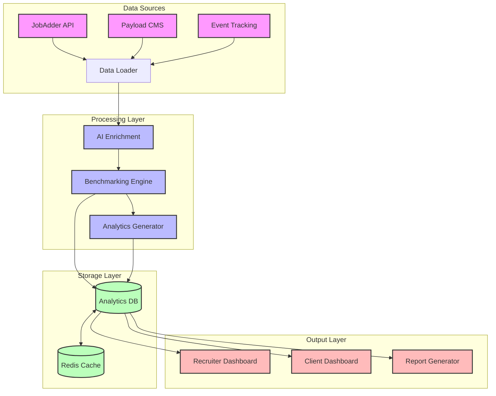
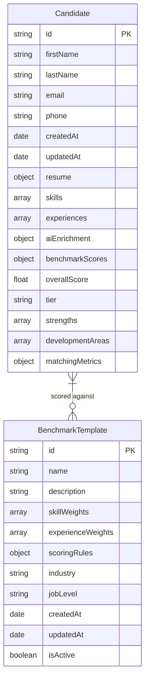
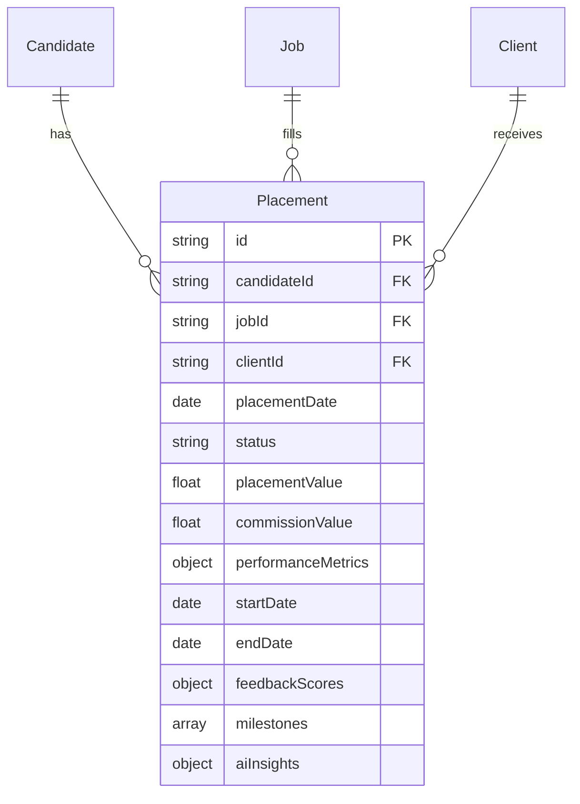
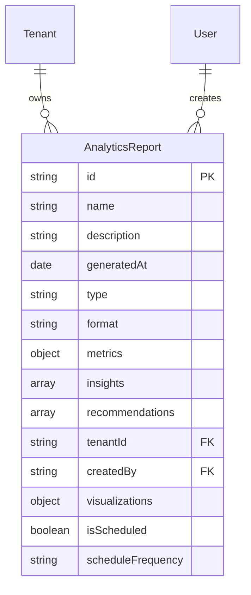
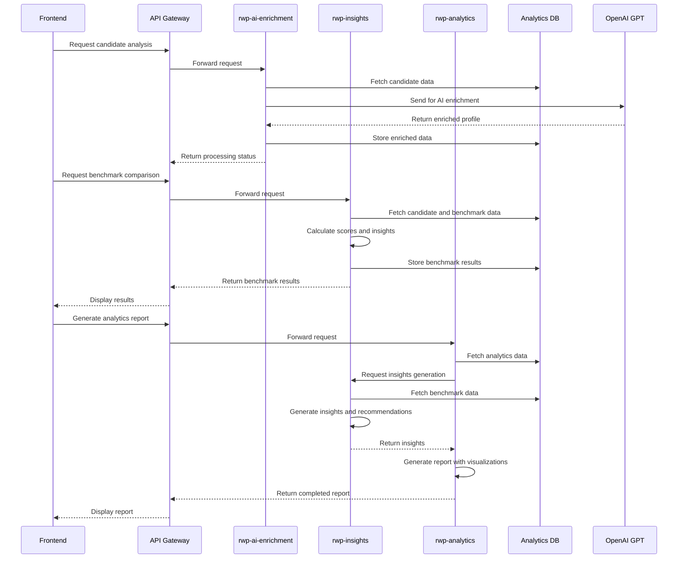

# AI Benchmarking & Analytics Architecture

## 1. Overview

The AI Benchmarking & Analytics system consists of two primary modules designed to enhance the RWP 4.0 platform's recruitment capabilities:

### AI Benchmarking Engine

This module provides recruiters with data-driven guidance by:
- Analyzing candidate profiles against industry benchmarks
- Identifying high-potential candidates based on historical placement success
- Providing AI-powered recommendations for candidate selection
- Offering real-time scoring during the recruitment process

### Hiring Analytics Dashboard & Insight Reporting

This module delivers actionable insights through:
- Comprehensive analytics dashboards for recruiters and clients
- Automated report generation with key performance indicators
- Trend analysis across recruitment cycles
- Predictive analytics for future hiring needs

Together, these modules form a powerful system that leverages AI to optimize the recruitment process, improve placement success rates, and provide valuable insights to both recruiters and clients.

## 2. System Architecture

The system architecture follows a modular design with clear separation between data ingestion, processing, storage, and presentation layers:

1. **Data Sources Layer**:
   - JobAdder API integration for candidate and placement data
   - Payload CMS for content management and configuration
   - Event Tracking system for user interactions and behavioral data

2. **Processing Layer**:
   - AI Enrichment module for enhancing candidate profiles with AI-derived insights
   - Benchmarking Engine for comparing candidates against industry standards
   - Analytics Generator for creating actionable insights and reports

3. **Storage Layer**:
   - Analytics Database for persistent storage of processed data
   - Redis Cache for high-performance data access and real-time analytics

4. **Output Layer**:
   - Recruiter Dashboard for internal team use
   - Client Dashboard for external stakeholder access
   - Report Generator for automated insight delivery

## 3. Data Model Extensions

### Candidate Model

### Placement Model

### Analytics Report Model

## 4. Implementation Phases

### Phase 1: Data Foundation (Weeks 1-2)

- **Week 1**:
  - Set up Analytics Database schema extensions
  - Implement data connectors for JobAdder API
  - Create data transformation pipelines
  - Establish Redis caching layer

- **Week 2**:
  - Develop event tracking integration
  - Implement data validation and cleaning processes
  - Create initial data aggregation functions
  - Set up automated data refresh mechanisms

### Phase 2: AI Enrichment Engine (Weeks 3-4)

- **Week 3**:
  - Develop candidate profile enrichment algorithms
  - Implement skills extraction and categorization
  - Create experience evaluation algorithms
  - Build initial benchmarking templates

- **Week 4**:
  - Develop scoring algorithms for candidate evaluation
  - Implement benchmark comparison logic
  - Create AI-powered recommendation engine
  - Build candidate tier classification system

### Phase 3: Analytics & Reporting (Weeks 5-6)

- **Week 5**:
  - Develop recruiter analytics dashboard
  - Implement client-facing analytics views
  - Create automated report generation system
  - Build visualization components

- **Week 6**:
  - Implement predictive analytics models
  - Develop trend analysis algorithms
  - Create custom report templates
  - Build scheduled reporting functionality

### Phase 4: Integration & Testing (Weeks 7-8)

- **Week 7**:
  - Integrate with existing RWP 4.0 components
  - Implement authentication and authorization
  - Conduct performance testing and optimization
  - Begin user acceptance testing

- **Week 8**:
  - Address feedback from user testing
  - Finalize documentation
  - Conduct security and compliance review
  - Prepare for production deployment

## 5. Technical Components

### New Microservices

#### rwp-ai-enrichment

- **Purpose**: Handles all AI-powered data enrichment and analysis
- **Key Functions**:
  - Candidate profile enrichment
  - Skills and experience extraction
  - Natural language processing of resumes and job descriptions
  - Integration with OpenAI/GPT for advanced analysis
- **Technologies**:
  - Node.js with TypeScript
  - OpenAI API integration
  - Vector database for semantic search
  - Queue system for asynchronous processing

#### rwp-insights

- **Purpose**: Generates actionable insights and recommendations
- **Key Functions**:
  - Benchmark template management
  - Scoring algorithm execution
  - Report generation and delivery
  - Predictive analytics processing
- **Technologies**:
  - Node.js with TypeScript
  - Data visualization libraries
  - PDF generation for reports
  - Scheduled job processing

### Extensions to Existing Services

#### rwp-analytics

- **Enhancements**:
  - Extended data models for AI benchmarking
  - New API endpoints for insight retrieval
  - Enhanced dashboard components
  - Integration with rwp-ai-enrichment service
- **New Components**:
  - Benchmark management interface
  - Advanced filtering and segmentation
  - Custom report builder
  - Trend visualization tools

#### rwp-events

- **Enhancements**:
  - Extended event tracking for AI interactions
  - New event types for benchmarking activities
  - Enhanced analytics event processing
  - Real-time event streaming for dashboards
- **New Components**:
  - Event correlation engine
  - User journey tracking
  - A/B testing framework for AI recommendations
  - Conversion tracking for placement outcomes

## 6. API Structure

### API Endpoints

#### AI Enrichment API

- `POST /api/ai/enrich/candidate`: Enrich candidate profile with AI insights
- `GET /api/ai/candidate/:id/enrichment`: Retrieve AI enrichment data for a candidate
- `POST /api/ai/analyze/resume`: Analyze and extract data from resume
- `POST /api/ai/compare/job-match`: Compare candidate to job requirements

#### Benchmarking API

- `GET /api/benchmarks`: List available benchmark templates
- `GET /api/benchmarks/:id`: Get specific benchmark template
- `POST /api/benchmarks`: Create new benchmark template
- `PUT /api/benchmarks/:id`: Update benchmark template
- `POST /api/benchmarks/score/:candidateId`: Score candidate against benchmarks
- `GET /api/candidates/:id/benchmark-scores`: Get benchmark scores for candidate

#### Analytics API

- `GET /api/analytics/dashboard/:type`: Get dashboard data (recruiter or client)
- `GET /api/analytics/reports`: List available reports
- `GET /api/analytics/reports/:id`: Get specific report
- `POST /api/analytics/reports/generate`: Generate custom report
- `GET /api/analytics/insights/:type`: Get specific insights (trends, predictions)

## 7. Privacy & Compliance

### Data Handling

- **Data Minimization**: Only essential data is processed and stored
- **Data Retention**: Automated policies for data retention and deletion
- **Anonymization**: Options for anonymized analytics and reporting
- **Encryption**: All sensitive data is encrypted at rest and in transit

### Access Control

- **Role-Based Access**: Granular permissions for different user roles
- **Client Data Isolation**: Multi-tenant architecture with strict data separation
- **Audit Logging**: Comprehensive logging of all data access and modifications
- **Two-Factor Authentication**: Enhanced security for sensitive operations

### Compliance Features

- **GDPR Compliance**: Built-in tools for data subject requests
- **Consent Management**: Tracking of user consent for data processing
- **Privacy by Design**: Privacy considerations integrated into all components
- **Compliance Reporting**: Automated generation of compliance reports

## 8. Monitoring & Maintenance

### Performance Metrics

- **System Health Monitoring**:
  - API response times and availability
  - Processing queue lengths and completion times
  - Database performance and query optimization
  - Cache hit rates and memory usage

- **AI Performance Metrics**:
  - Enrichment accuracy and quality scores
  - Benchmark correlation with placement success
  - Recommendation relevance feedback
  - Model drift detection

### Cost Monitoring

- **Resource Usage Tracking**:
  - Compute resources by service
  - Storage utilization and growth trends
  - API call volumes and patterns
  - AI service consumption (tokens, requests)

- **Optimization Strategies**:
  - Tiered processing based on priority
  - Caching strategies for frequent queries
  - Batch processing for non-time-sensitive operations
  - Scheduled vs. on-demand report generation

### Maintenance Procedures

- **Regular Updates**:
  - Benchmark template refreshes based on market changes
  - AI model retraining and improvement
  - Analytics algorithm refinement
  - Dashboard and report template updates

- **Scaling Procedures**:
  - Horizontal scaling for increased load
  - Database sharding strategy
  - Cache warming procedures
  - Load balancing configuration