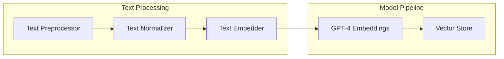
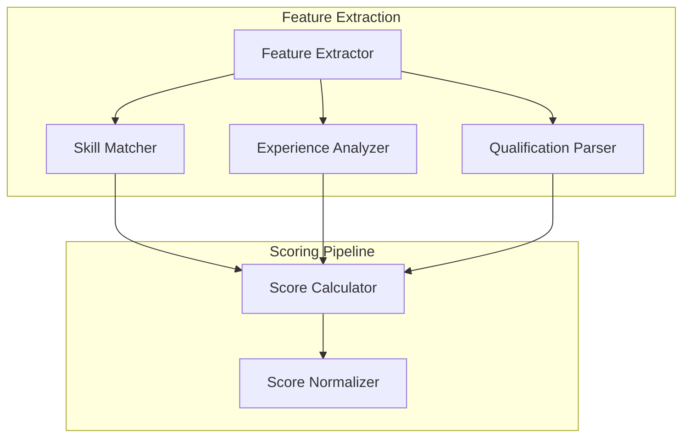
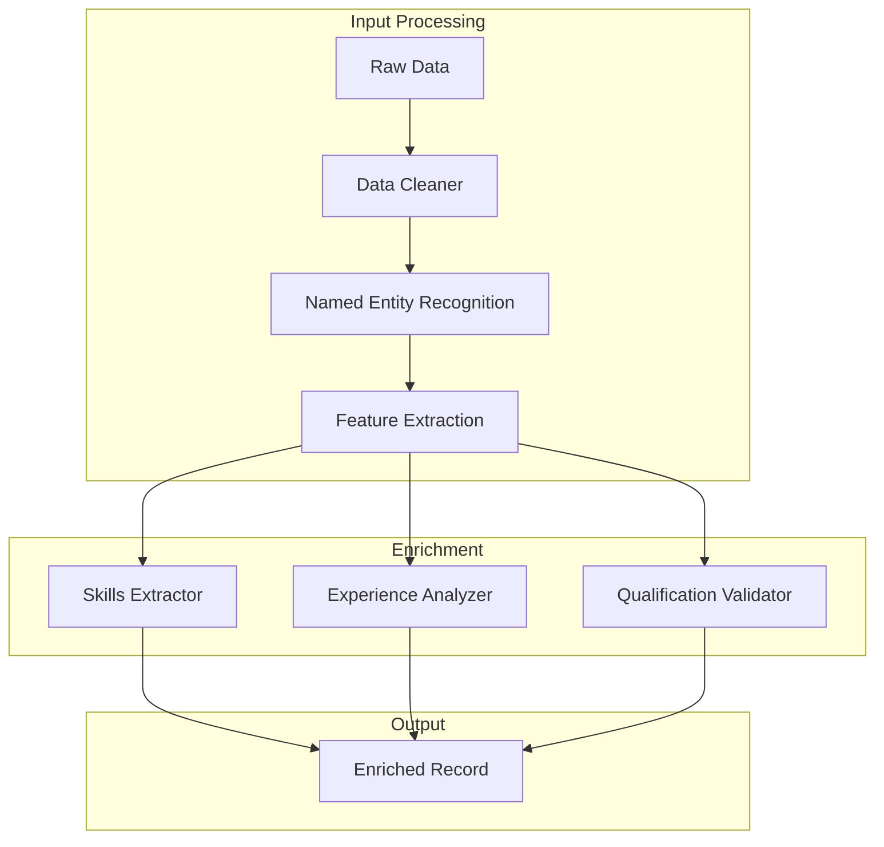
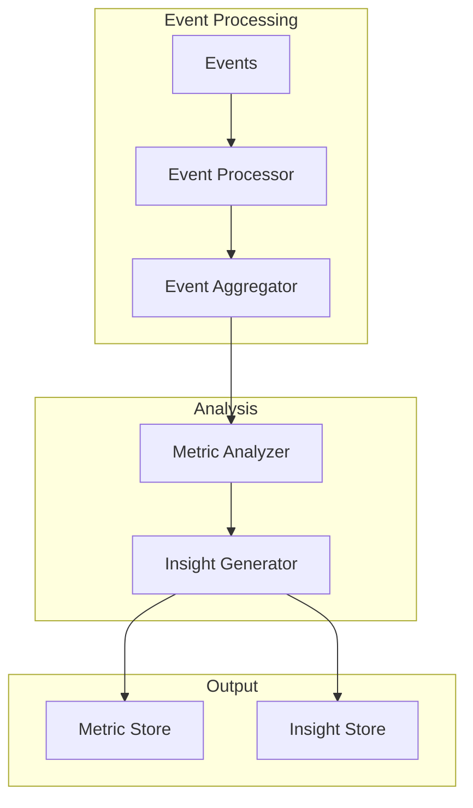
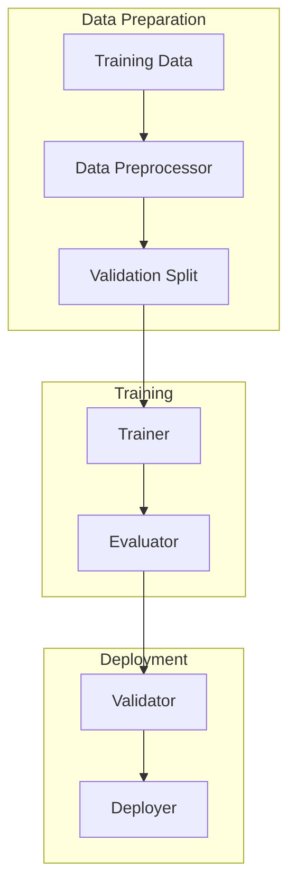

# AI Technical Specification

## 1. Model Architecture

### 1.1 Embedding Models



#### Text Processing
- Preprocessing: Clean and normalize text
- Tokenization: GPT-4 tokenizer
- Max length: 8192 tokens
- Output: 1536-dimensional vectors

#### Implementation
```typescript
interface EmbeddingService {
  generateEmbedding(text: string): Promise<Float32Array>;
  batchProcess(texts: string[]): Promise<Float32Array[]>;
  updateEmbeddings(documents: Document[]): Promise<void>;
}
```

### 1.2 Scoring Models



#### Features
- Skills matching (cosine similarity)
- Experience level analysis
- Qualification mapping
- Role alignment scoring

#### Implementation
```typescript
interface ScoringService {
  calculateScore(candidate: Candidate, job: Job): Promise<Score>;
  updateScores(candidates: Candidate[]): Promise<void>;
  getBenchmarks(jobType: string): Promise<Benchmark>;
}
```

## 2. Data Processing Pipelines

### 2.1 Enrichment Pipeline



#### Components
```typescript
interface EnrichmentPipeline {
  cleanData(data: RawData): Promise<CleanData>;
  extractEntities(data: CleanData): Promise<EntityMap>;
  extractFeatures(entities: EntityMap): Promise<FeatureSet>;
  enrichRecord(features: FeatureSet): Promise<EnrichedRecord>;
}
```

### 2.2 Analytics Pipeline



#### Implementation
```typescript
interface AnalyticsPipeline {
  processEvents(events: Event[]): Promise<ProcessedEvents>;
  calculateMetrics(events: ProcessedEvents): Promise<Metrics>;
  generateInsights(metrics: Metrics): Promise<Insights>;
}
```

## 3. Integration Points

### 3.1 OpenAI Integration

```typescript
interface OpenAIService {
  // Embedding generation
  generateEmbeddings(text: string): Promise<Float32Array>;
  
  // Content generation
  generateSummary(data: AnalyticsData): Promise<string>;
  generateInsights(metrics: Metrics): Promise<string>;
  
  // Error handling
  handleRateLimit(): Promise<void>;
  handleError(error: OpenAIError): Promise<void>;
}
```

### 3.2 Vector Database Integration

```typescript
interface VectorStore {
  // Vector operations
  storeVector(id: string, vector: Float32Array): Promise<void>;
  findSimilar(vector: Float32Array, k: number): Promise<SimilarityMatch[]>;
  updateVector(id: string, vector: Float32Array): Promise<void>;
  
  // Batch operations
  batchStore(vectors: VectorBatch): Promise<void>;
  batchQuery(vectors: Float32Array[], k: number): Promise<SimilarityMatch[][]>;
}
```

## 4. Model Training & Updates

### 4.1 Training Pipeline



#### Implementation
```typescript
interface TrainingPipeline {
  prepareData(data: TrainingData): Promise<PreparedData>;
  trainModel(data: PreparedData): Promise<ModelArtifacts>;
  evaluateModel(model: ModelArtifacts): Promise<Metrics>;
  deployModel(model: ModelArtifacts): Promise<void>;
}
```

## 5. Performance Optimization

### 5.1 Caching Strategy

```typescript
interface CacheManager {
  // Embedding cache
  cacheEmbedding(key: string, embedding: Float32Array): Promise<void>;
  getCachedEmbedding(key: string): Promise<Float32Array | null>;
  
  // Score cache
  cacheScore(candidateId: string, jobId: string, score: Score): Promise<void>;
  getCachedScore(candidateId: string, jobId: string): Promise<Score | null>;
  
  // Cache management
  invalidateCache(pattern: string): Promise<void>;
  pruneCache(): Promise<void>;
}
```

### 5.2 Batch Processing

```typescript
interface BatchProcessor {
  // Batch configuration
  setBatchSize(size: number): void;
  setProcessingInterval(ms: number): void;
  
  // Processing
  addToBatch(item: ProcessItem): void;
  processBatch(): Promise<ProcessResult[]>;
  
  // Monitoring
  getBatchStats(): BatchStats;
  getProcessingMetrics(): ProcessingMetrics;
}
```

## 6. Error Handling & Monitoring

### 6.1 Error Handling

```typescript
interface ErrorHandler {
  // Error processing
  handleModelError(error: ModelError): Promise<void>;
  handleAPIError(error: APIError): Promise<void>;
  handleDataError(error: DataError): Promise<void>;
  
  // Recovery
  retryOperation(operation: Operation): Promise<void>;
  fallbackStrategy(context: ErrorContext): Promise<void>;
}
```

### 6.2 Monitoring

```typescript
interface AIMonitor {
  // Metrics
  recordLatency(operation: string, duration: number): void;
  recordAccuracy(predicted: any, actual: any): void;
  recordUsage(endpoint: string, tokens: number): void;
  
  // Alerts
  checkThresholds(): Promise<Alert[]>;
  notifyDeviation(metric: string, value: number): Promise<void>;
}
```

## 7. Security & Privacy

### 7.1 Data Protection

```typescript
interface DataProtection {
  // PII handling
  maskPII(data: any): Promise<any>;
  encryptSensitiveData(data: any): Promise<any>;
  
  // Access control
  checkPermissions(user: User, operation: Operation): Promise<boolean>;
  auditAccess(user: User, resource: Resource): Promise<void>;
}
```

### 7.2 Model Security

```typescript
interface ModelSecurity {
  // Model protection
  validateInput(input: any): Promise<boolean>;
  sanitizeOutput(output: any): Promise<any>;
  
  // Attack prevention
  detectAdversarialInput(input: any): Promise<boolean>;
  preventPromptInjection(prompt: string): Promise<string>;
}
```

## 8. Testing & Validation

### 8.1 Model Testing

```typescript
interface ModelTester {
  // Test suites
  runAccuracyTests(): Promise<TestResults>;
  runPerformanceTests(): Promise<TestResults>;
  runSecurityTests(): Promise<TestResults>;
  
  // Validation
  validateOutput(output: any, expected: any): Promise<ValidationResult>;
  measureBias(results: TestResults): Promise<BiasMetrics>;
}
```

### 8.2 Integration Testing

```typescript
interface IntegrationTester {
  // Pipeline tests
  testEnrichmentPipeline(): Promise<TestResults>;
  testScoringPipeline(): Promise<TestResults>;
  testAnalyticsPipeline(): Promise<TestResults>;
  
  // End-to-end tests
  testFullWorkflow(): Promise<TestResults>;
  validateIntegration(): Promise<ValidationResult>;
}