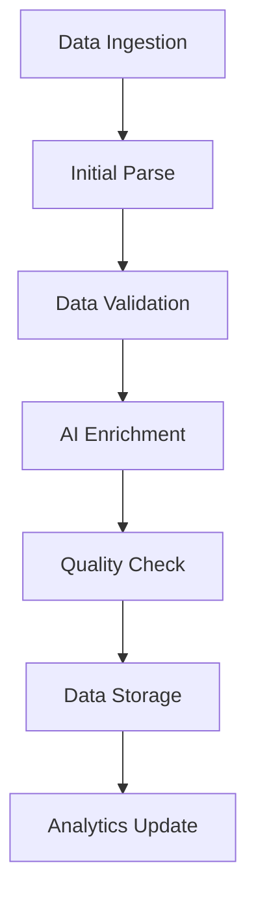

# Candidate Data Enrichment Technical Specification

## 1. Data Sources & Integration

### 1.1 CV/Resume Parsing
- **Input Format Support**
  - PDF, DOCX, RTF, TXT formats
  - HTML from job board applications
  - Plain text from email submissions

- **Parsing Engine**
  - Primary: GPT-4 with custom prompt engineering
  - Backup: Claude for high-volume processing
  - Structured output in JSON format

- **Extracted Data Points**
  - Contact information
  - Work experience timeline
  - Education history
  - Skills and certifications
  - Projects and achievements
  - Technical keywords and tools

### 1.2 JobAdder Integration
- **API Endpoints**
  - `/candidates` - List/search candidates
  - `/candidates/{id}` - Detailed profile
  - `/candidates/{id}/resume` - Resume content
  - `/candidates/{id}/placements` - Placement history

- **Sync Operations**
  - Real-time webhook processing
  - Scheduled daily full sync
  - Delta sync for updates
  - Conflict resolution strategy

### 1.3 Historical Placement Data
- **Data Points**
  - Placement success rates
  - Time-to-fill metrics
  - Salary benchmarks
  - Role progression patterns
  - Performance feedback
  - Retention statistics

### 1.4 Industry Benchmarks
- **Sources**
  - Aggregated placement data
  - Market salary surveys
  - Skills demand trends
  - Geographic variations
  - Role-specific metrics

## 2. Enrichment Pipeline

### 2.1 Processing Flow


### 2.2 Processing Steps
1. **Data Ingestion**
   - Webhook event capture
   - File upload processing
   - API data synchronization
   - Source tracking and metadata

2. **Initial Parse**
   - Document conversion
   - Text extraction
   - Structure detection
   - Entity recognition

3. **Data Validation**
   - Schema compliance
   - Required field checks
   - Format standardization
   - Duplicate detection

4. **AI Enrichment**
   - Skills extraction
   - Experience analysis
   - Potential scoring
   - Market alignment

5. **Quality Checks**
   - Completeness verification
   - Consistency validation
   - Privacy compliance
   - Data accuracy scoring

6. **Storage & Analytics**
   - Database writes
   - Cache updates
   - Analytics processing
   - Event tracking

### 2.3 AI Models & Algorithms

#### Skills Extraction Model
- **Architecture**: Fine-tuned GPT-4
- **Training Data**: Historical placements
- **Output Format**:
```json
{
  "technical_skills": [...],
  "soft_skills": [...],
  "proficiency_levels": {...},
  "certifications": [...],
  "confidence_scores": {...}
}
```

#### Experience Assessment Model
- **Architecture**: Custom neural network
- **Features**:
  - Role duration
  - Progression pattern
  - Company tiers
  - Achievement metrics
  - Responsibility scope

#### Industry Alignment Model
- **Architecture**: Hybrid ML (gradient boosting + neural network)
- **Input Features**:
  - Role matches
  - Skills alignment
  - Experience level
  - Market demand
  - Salary alignment

### 2.4 Data Transformation Rules

#### Text Normalization
- Case standardization
- Whitespace handling
- Special character processing
- Abbreviation expansion

#### Entity Standardization
- Company names
- Job titles
- Educational institutions
- Certification names
- Technology terms

#### Date Handling
- Format standardization
- Duration calculation
- Gap detection
- Overlap resolution

## 3. Specific Enrichment Types

### 3.1 Skills Extraction & Categorization
- **Categories**
  - Technical skills
  - Soft skills
  - Domain expertise
  - Tools & technologies
  - Methodologies
  - Languages

- **Enrichment Data**
```json
{
  "skill_category": "string",
  "skill_name": "string",
  "confidence": float,
  "source": "string",
  "last_used": "date",
  "experience_level": "string",
  "market_demand": float
}
```

### 3.2 Experience Level Assessment
- **Scoring Factors**
  - Years of experience
  - Role progression
  - Company tier
  - Project scope
  - Team size
  - Budget responsibility

- **Output Format**
```json
{
  "overall_level": "string",
  "years_experience": number,
  "leadership_score": float,
  "technical_depth": float,
  "industry_expertise": float,
  "growth_trajectory": float
}
```

### 3.3 Industry Alignment Scoring
- **Alignment Dimensions**
  - Role fit
  - Industry experience
  - Required skills match
  - Cultural indicators
  - Salary alignment
  - Location match

- **Scoring Model**
```json
{
  "overall_alignment": float,
  "role_match_score": float,
  "industry_fit": float,
  "skills_coverage": float,
  "experience_alignment": float,
  "location_compatibility": float
}
```

### 3.4 Cultural Fit Indicators
- **Assessment Areas**
  - Communication style
  - Work preferences
  - Management approach
  - Team dynamics
  - Values alignment
  - Growth mindset

- **Data Structure**
```json
{
  "cultural_indicators": {
    "communication_style": "string",
    "work_environment_fit": "string",
    "team_collaboration": float,
    "leadership_potential": float,
    "adaptability": float
  }
}
```

### 3.5 Performance Potential Metrics
- **Evaluation Criteria**
  - Historical performance
  - Skill progression
  - Learning agility
  - Achievement ratio
  - Innovation indicators
  - Leadership markers

- **Metric Format**
```json
{
  "potential_score": float,
  "growth_trajectory": "string",
  "risk_factors": [...],
  "development_areas": [...],
  "strengths": [...],
  "recommendations": [...]
}
```

## 4. Technical Implementation

### 4.1 API Workflows

#### Candidate Processing API
```typescript
interface CandidateProcessingAPI {
  // Ingestion endpoints
  POST /api/candidates/process
  POST /api/candidates/batch-process
  
  // Enrichment endpoints
  POST /api/candidates/{id}/enrich
  POST /api/candidates/{id}/skills
  POST /api/candidates/{id}/experience
  
  // Analysis endpoints
  GET /api/candidates/{id}/alignment
  GET /api/candidates/{id}/potential
  GET /api/candidates/benchmarks
}
```

#### Webhook Handlers
```typescript
interface WebhookHandlers {
  // JobAdder events
  POST /api/webhooks/jobadder/candidate
  POST /api/webhooks/jobadder/placement
  
  // Processing events
  POST /api/webhooks/enrichment/complete
  POST /api/webhooks/analysis/complete
}
```

### 4.2 Data Processing Algorithms

#### Resume Text Processing
```typescript
interface ResumeProcessor {
  extractStructuredData(text: string): Promise<ParsedResume>;
  identifyEntities(text: string): Promise<EntityMap>;
  calculateMetrics(parsed: ParsedResume): Promise<ResumeMetrics>;
}
```

#### Skills Analysis
```typescript
interface SkillsAnalyzer {
  extractSkills(text: string): Promise<SkillSet>;
  categorizeSkills(skills: string[]): Promise<SkillCategories>;
  calculateProficiency(experience: Experience[]): Promise<SkillLevels>;
}
```

#### Experience Evaluation
```typescript
interface ExperienceEvaluator {
  assessLevel(experience: Experience[]): Promise<ExperienceLevel>;
  calculateProgression(roles: Role[]): Promise<ProgressionMetrics>;
  predictPotential(candidate: Candidate): Promise<PotentialScore>;
}
```

### 4.3 Model Integration Points

#### AI Model Pipeline


#### Model Deployment
- GPT-4 API integration
- Custom model hosting on DigitalOcean
- Model versioning and A/B testing
- Performance monitoring
- Feedback loops

### 4.4 Storage & Caching

#### Database Schema
```sql
-- Enriched candidate data
CREATE TABLE candidate_enrichment (
  id UUID PRIMARY KEY,
  candidate_id UUID REFERENCES candidates(id),
  enrichment_data JSONB,
  confidence_scores JSONB,
  last_updated TIMESTAMP,
  version INTEGER
);

-- Processing queue
CREATE TABLE enrichment_queue (
  id UUID PRIMARY KEY,
  candidate_id UUID,
  status VARCHAR(50),
  priority INTEGER,
  created_at TIMESTAMP,
  processed_at TIMESTAMP
);

-- Benchmark data
CREATE TABLE industry_benchmarks (
  id UUID PRIMARY KEY,
  industry VARCHAR(100),
  role_level VARCHAR(50),
  metrics JSONB,
  updated_at TIMESTAMP
);
```

#### Caching Strategy
- Redis for real-time scoring
- Materialized views for benchmarks
- CDN for static resources
- Local memory for frequent lookups

## 5. Privacy & Compliance

### 5.1 Data Protection
- PII identification and handling
- Data retention policies
- Access control and audit logs
- Encryption at rest and in transit

### 5.2 Consent Management
- Granular consent tracking
- Purpose limitation
- Data subject rights
- Audit trail maintenance

### 5.3 Compliance Checks
- Automated PII detection
- Consent verification
- Usage limitation enforcement
- Regular compliance audits

## 6. Monitoring & Maintenance

### 6.1 Performance Metrics
- Processing time tracking
- Accuracy measurements
- API response times
- Model performance stats

### 6.2 Error Handling
- Retry mechanisms
- Fallback processing
- Error notification
- Recovery procedures

### 6.3 Maintenance Tasks
- Model retraining
- Benchmark updates
- Cache invalidation
- Database optimization