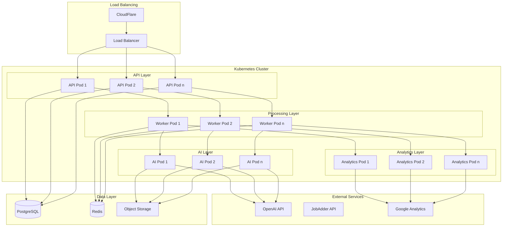

# Deployment Architecture

## Infrastructure Overview



## Component Specifications

### Kubernetes Resources

#### API Pods
```yaml
apiVersion: apps/v1
kind: Deployment
metadata:
  name: api-deployment
spec:
  replicas: 3
  template:
    spec:
      containers:
      - name: api
        image: rwp/api:latest
        resources:
          requests:
            cpu: 1
            memory: 2Gi
          limits:
            cpu: 2
            memory: 4Gi
        livenessProbe:
          httpGet:
            path: /health
            port: 3000
        readinessProbe:
          httpGet:
            path: /ready
            port: 3000
```

#### Worker Pods
```yaml
apiVersion: apps/v1
kind: Deployment
metadata:
  name: worker-deployment
spec:
  replicas: 5
  template:
    spec:
      containers:
      - name: worker
        image: rwp/worker:latest
        resources:
          requests:
            cpu: 2
            memory: 4Gi
          limits:
            cpu: 4
            memory: 8Gi
```

#### AI Processing Pods
```yaml
apiVersion: apps/v1
kind: Deployment
metadata:
  name: ai-deployment
spec:
  replicas: 3
  template:
    spec:
      containers:
      - name: ai-processor
        image: rwp/ai-processor:latest
        resources:
          requests:
            cpu: 4
            memory: 8Gi
          limits:
            cpu: 8
            memory: 16Gi
        env:
        - name: OPENAI_API_KEY
          valueFrom:
            secretKeyRef:
              name: ai-secrets
              key: openai-api-key
```

### Scaling Configuration

#### Horizontal Pod Autoscaling
```yaml
apiVersion: autoscaling/v2
kind: HorizontalPodAutoscaler
metadata:
  name: api-hpa
spec:
  scaleTargetRef:
    apiVersion: apps/v1
    kind: Deployment
    name: api-deployment
  minReplicas: 3
  maxReplicas: 10
  metrics:
  - type: Resource
    resource:
      name: cpu
      target:
        type: Utilization
        averageUtilization: 70
```

### Storage Configuration

#### PostgreSQL StatefulSet
```yaml
apiVersion: apps/v1
kind: StatefulSet
metadata:
  name: postgres
spec:
  serviceName: postgres
  replicas: 3
  template:
    spec:
      containers:
      - name: postgres
        image: postgres:15
        volumeMounts:
        - name: postgres-data
          mountPath: /var/lib/postgresql/data
  volumeClaimTemplates:
  - metadata:
      name: postgres-data
    spec:
      accessModes: [ "ReadWriteOnce" ]
      resources:
        requests:
          storage: 100Gi
```

## Monitoring & Observability

### Prometheus Configuration
```yaml
apiVersion: monitoring.coreos.com/v1
kind: ServiceMonitor
metadata:
  name: api-monitor
spec:
  selector:
    matchLabels:
      app: api
  endpoints:
  - port: metrics
    interval: 15s
```

### Grafana Dashboards
```yaml
apiVersion: integreatly.org/v1alpha1
kind: GrafanaDashboard
metadata:
  name: system-metrics
spec:
  json: |
    {
      "title": "System Metrics",
      "panels": [
        {
          "title": "API Response Time",
          "type": "graph"
        },
        {
          "title": "Processing Queue Length",
          "type": "graph"
        },
        {
          "title": "AI Processing Time",
          "type": "graph"
        }
      ]
    }
```

## Security Configuration

### Network Policies
```yaml
apiVersion: networking.k8s.io/v1
kind: NetworkPolicy
metadata:
  name: api-network-policy
spec:
  podSelector:
    matchLabels:
      app: api
  policyTypes:
  - Ingress
  - Egress
  ingress:
  - from:
    - podSelector:
        matchLabels:
          app: frontend
    ports:
    - protocol: TCP
      port: 3000
```

### Secret Management
```yaml
apiVersion: external-secrets.io/v1beta1
kind: ExternalSecret
metadata:
  name: ai-secrets
spec:
  refreshInterval: "1h"
  secretStoreRef:
    name: vault-backend
    kind: ClusterSecretStore
  target:
    name: ai-secrets
  data:
  - secretKey: openai-api-key
    remoteRef:
      key: openai/api-key
```

## Deployment Strategy

### Rolling Updates
```yaml
apiVersion: apps/v1
kind: Deployment
metadata:
  name: api-deployment
spec:
  strategy:
    type: RollingUpdate
    rollingUpdate:
      maxSurge: 1
      maxUnavailable: 0
```

## Resource Requirements

### Minimum Cluster Specifications
- 6 nodes (2 for API, 2 for workers, 2 for data)
- Each node: 8 CPU cores, 32GB RAM
- Storage: 500GB per data node
- Network: 10Gbps between nodes

### Scaling Thresholds
- CPU utilization > 70%
- Memory utilization > 80%
- Queue length > 1000
- Response time > 200ms

## Backup & Disaster Recovery

### Backup Schedule
- Database: Hourly incremental, daily full
- Object storage: Daily incremental
- Configuration: Version controlled
- Retention: 30 days

### Recovery Procedures
1. Database restoration
2. Configuration redeployment
3. Service verification
4. Data consistency checks

## Monitoring Alerts

### Critical Alerts
- Service availability < 99.9%
- Error rate > 1%
- Processing delay > 5 minutes
- Database replication lag > 10 seconds

### Warning Alerts
- CPU utilization > 80%
- Memory utilization > 85%
- Disk usage > 85%
- Queue growth rate > normal

## Cost Optimization

### Resource Management
- Spot instances for workers
- Autoscaling based on demand
- Resource quotas per namespace
- Regular cost analysis

### Performance Optimization
- CDN for static assets
- Query optimization
- Cache utilization
- Batch processing