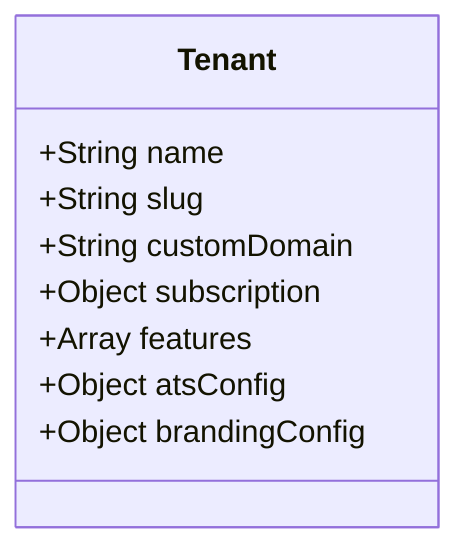
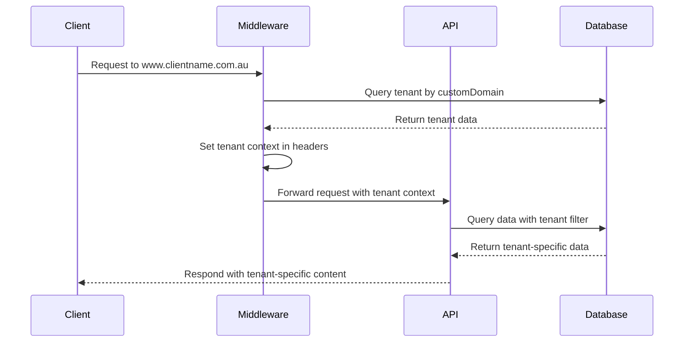

# Rec Website Platform 4.1 - Implementation Plan

## 1. Overview

This document outlines the implementation plan for Rec Website Platform 4.1, a modular, multi-tenant SaaS platform designed for recruitment agencies. The MVP will focus on multi-tenant isolation, custom domain routing, basic job board functionality, and JobAdder integration, to be delivered within a 4-day timeline.

## 2. Current State Assessment

The existing codebase already includes:
- Basic Payload CMS setup with PostgreSQL
- Initial collections for Tenants, Users, Jobs, and Media
- Partial implementation of Stripe billing
- Basic ATS integration framework for JobAdder and Bullhorn

## 3. MVP Implementation Plan

### Day 1: Multi-Tenant Architecture & Domain Routing

#### Task 1.1: Enhance Tenant Model (2 hours)


- Update the Tenants collection to include:
  - `customDomain` field for custom domain support
  - Enhanced access control rules for tenant isolation
  - Additional branding configuration fields (logo, colors, etc.)

#### Task 1.2: Implement Next.js Middleware for Domain Routing (4 hours)


- Create middleware.ts to handle domain resolution
- Implement tenant caching for performance
- Set up tenant context for downstream requests
- Handle domain not found scenarios

#### Task 1.3: Enhance JWT Authentication with Tenant Scoping (2 hours)
- Modify Payload auth configuration to include tenant ID in JWT tokens
- Update access control rules to enforce tenant isolation
- Implement tenant-aware login and registration flows

### Day 2: Tenant Isolation & Job Board Basics

#### Task 2.1: Implement Tenant Isolation in All Collections (3 hours)
- Update all collections to include tenant relationship
- Enforce tenant-scoped access control in every collection
- Add tenant filtering to all queries
- Test isolation to ensure no cross-tenant data access

#### Task 2.2: Develop Basic Job Board Frontend (5 hours)
```mermaid
componentDiagram
    component "Job Listing Page" {
        component "Search Filters"
        component "Job Cards"
        component "Pagination"
    }
    component "Job Detail Page" {
        component "Job Information"
        component "Application Form"
    }
    component "API Routes" {
        component "Job Listing API"
        component "Job Detail API"
        component "Job Application API"
    }
```

- Create job listing page with search and filters
- Implement job detail page with application form
- Develop API routes for job data with tenant filtering
- Add basic SEO optimization for job listings

### Day 3: JobAdder Integration & Tenant Onboarding

#### Task 3.1: Complete JobAdder Integration (4 hours)
- Enhance existing JobAdder integration (see separate document for details)
- Implement webhook handler for real-time updates
- Add CRON job for periodic synchronization
- Test end-to-end job synchronization

#### Task 3.2: Develop Tenant Onboarding Flow (4 hours)
- Create tenant registration form
- Implement domain verification process
- Develop basic branding configuration UI
- Set up JobAdder OAuth connection flow

### Day 4: Testing, Deployment & Documentation

#### Task 4.1: End-to-End Testing (3 hours)
- Test multi-tenant isolation
- Verify custom domain routing
- Test job board functionality
- Validate JobAdder integration

#### Task 4.2: Deployment Setup (3 hours)
- Configure DigitalOcean Droplet for Payload CMS
- Set up Vercel deployment for frontend
- Configure DNS settings for test domains
- Implement environment variable management

#### Task 4.3: Documentation & Handover (2 hours)
- Document architecture and implementation details
- Create user guide for tenant onboarding
- Prepare technical documentation for future development
- Document known limitations and future enhancements

## 4. Technical Implementation Details

### Custom Domain Implementation
```typescript
// middleware.ts
import { NextRequest, NextResponse } from 'next/server';
import { getTenantByDomain } from './lib/tenants';

export async function middleware(req: NextRequest) {
  const hostname = req.headers.get('host') || '';
  
  // Skip for admin routes and API routes
  if (hostname.includes('admin.') || req.nextUrl.pathname.startsWith('/api/')) {
    return NextResponse.next();
  }
  
  // Get tenant from domain
  const tenant = await getTenantByDomain(hostname);
  
  if (!tenant) {
    return new NextResponse('Tenant not found', { status: 404 });
  }
  
  // Set tenant context in headers
  const res = NextResponse.next();
  res.headers.set('x-tenant-slug', tenant.slug);
  res.headers.set('x-tenant-id', tenant.id);
  
  return res;
}
```

### Tenant-Aware Data Fetching
```typescript
// lib/getTenantData.ts
export async function getJobsForTenant(tenantSlug: string) {
  const response = await fetch(`/api/jobs?where[tenant.slug][equals]=${tenantSlug}`);
  return response.json();
}
```

### Enhanced Tenant Model
```typescript
// collections/Tenants.ts (additions)
{
  name: 'customDomain',
  type: 'text',
  unique: true,
  admin: {
    description: 'The custom domain for this tenant (e.g., www.clientname.com.au)',
  },
},
{
  name: 'brandingConfig',
  type: 'group',
  fields: [
    {
      name: 'logo',
      type: 'upload',
      relationTo: 'media',
    },
    {
      name: 'primaryColor',
      type: 'text',
      defaultValue: '#007bff',
    },
    {
      name: 'secondaryColor',
      type: 'text',
      defaultValue: '#6c757d',
    },
  ],
},
```

## 5. Post-MVP Roadmap

After the MVP launch, we recommend focusing on these features in order of priority:

1. **Plasmic Visual Editor Integration** (1-2 weeks)
   - Implement Plasmic loader in Next.js
   - Create tenant-specific Plasmic projects
   - Develop component library for recruitment websites

2. **Advanced Job Board Features** (1-2 weeks)
   - Saved searches and job alerts
   - Candidate profiles and application tracking
   - Advanced search and filtering

3. **AI-Powered Features** (2-3 weeks)
   - Job description optimization
   - Candidate matching
   - Content generation

4. **Analytics and Reporting** (1-2 weeks)
   - Job performance metrics
   - Candidate source tracking
   - Conversion analytics

5. **Additional ATS Integrations** (1 week per integration)
   - Complete Bullhorn integration
   - Add support for additional ATS systems

## 6. Risks and Mitigations

| Risk | Impact | Mitigation |
|------|--------|------------|
| Custom domain DNS setup delays | High | Provide detailed DNS setup instructions and fallback to subdomain option |
| JobAdder API rate limits | Medium | Implement queuing and retry logic for API calls |
| Cross-tenant data leakage | High | Comprehensive testing of access control and tenant isolation |
| Performance issues with tenant resolution | Medium | Implement efficient caching of tenant data |
| Database scaling with multiple tenants | Low (for MVP) | Design schema with future scaling in mind, add indexes for tenant queries |