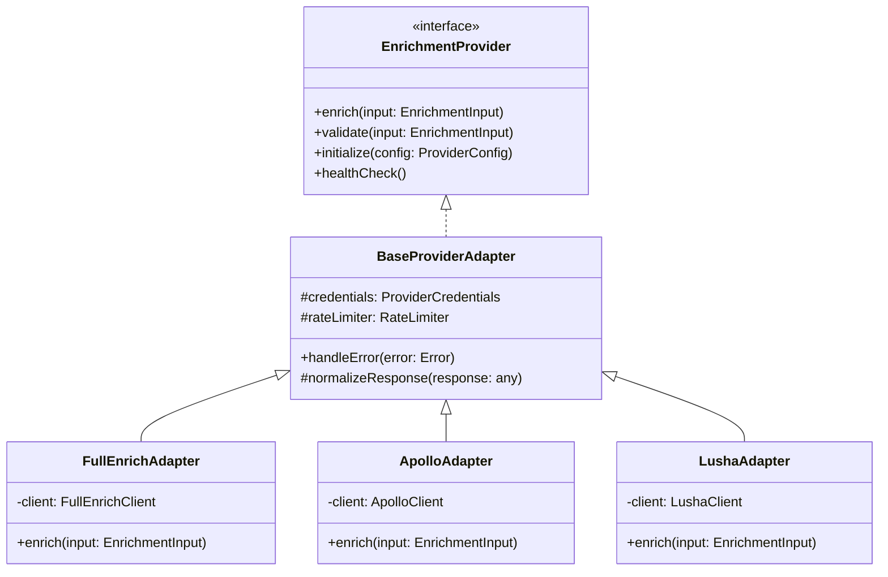
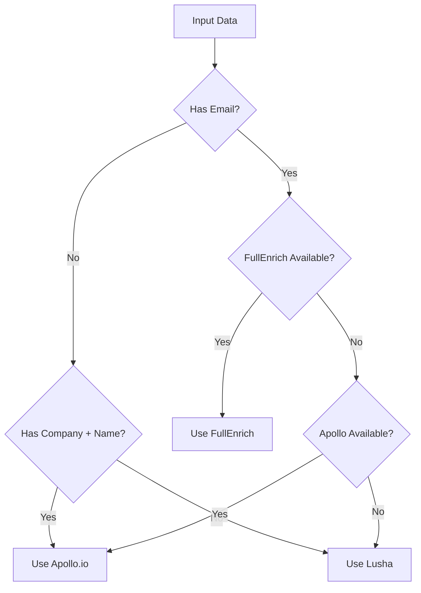
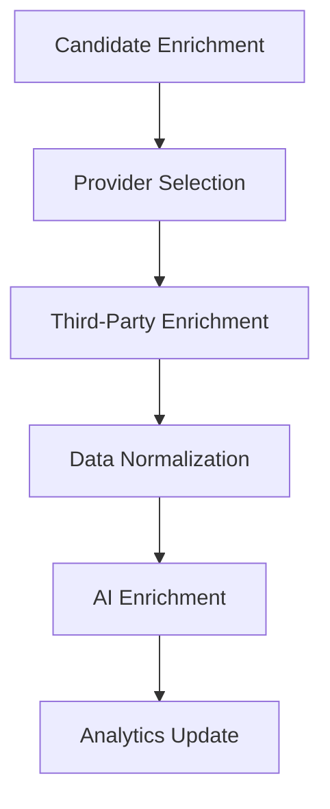
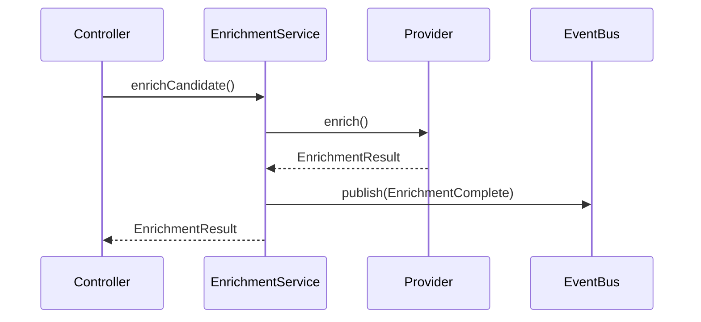
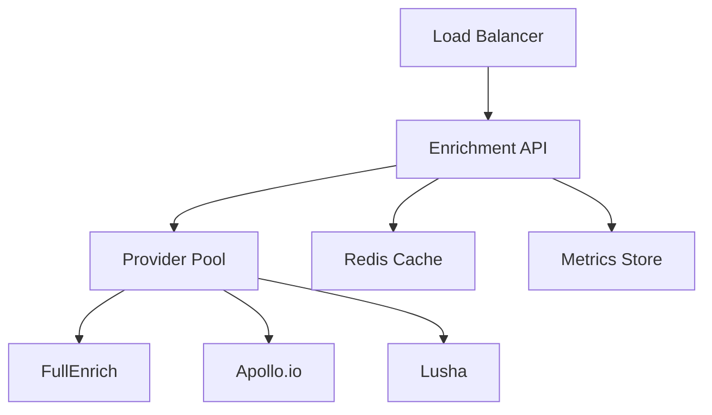

# Third-Party Enrichment Provider Architecture

## 1. Provider Interface Architecture

### 1.1 Abstract Provider Interface
```typescript
interface EnrichmentProvider {
  // Core enrichment methods
  enrich(input: EnrichmentInput): Promise<EnrichmentResult>;
  validate(input: EnrichmentInput): Promise<ValidationResult>;
  
  // Provider management
  initialize(config: ProviderConfig): Promise<void>;
  healthCheck(): Promise<HealthStatus>;
  
  // Rate limiting & quotas
  getRateLimit(): RateLimitInfo;
  getCosts(): CostMetrics;
}
```

### 1.2 Provider Adapter Pattern


### 1.3 Common Data Model
```typescript
interface EnrichmentInput {
  candidateId: string;
  email?: string;
  phone?: string;
  firstName?: string;
  lastName?: string;
  company?: string;
  title?: string;
  location?: string;
}

interface EnrichmentResult {
  providerId: string;
  timestamp: string;
  confidence: number;
  data: {
    professional?: ProfessionalInfo;
    social?: SocialPresence;
    contact?: ContactInfo;
    company?: CompanyInfo;
  };
  raw?: any;
}

interface ValidationResult {
  isValid: boolean;
  errors: ValidationError[];
  warnings: ValidationWarning[];
}
```

### 1.4 Error Handling & Fallback Strategies
```typescript
class EnrichmentError extends Error {
  constructor(
    message: string,
    public provider: string,
    public code: string,
    public retryable: boolean
  ) {
    super(message);
  }
}

interface FallbackStrategy {
  shouldFallback(error: EnrichmentError): boolean;
  getNextProvider(
    failed: string[],
    available: string[]
  ): string | null;
}

class ProviderFallbackHandler {
  private strategies: Map<string, FallbackStrategy>;
  
  async handleFailure(
    error: EnrichmentError,
    context: EnrichmentContext
  ): Promise<EnrichmentResult> {
    // Implementation
  }
}
```

## 2. Supported Providers

### 2.1 FullEnrich Integration
```typescript
class FullEnrichAdapter extends BaseProviderAdapter {
  private client: FullEnrichClient;
  
  async enrich(input: EnrichmentInput): Promise<EnrichmentResult> {
    const response = await this.client.enrichProfile({
      email: input.email,
      name: `${input.firstName} ${input.lastName}`,
      company: input.company
    });
    
    return this.normalizeResponse(response);
  }
  
  protected normalizeResponse(response: any): EnrichmentResult {
    return {
      providerId: 'fullenrich',
      timestamp: new Date().toISOString(),
      confidence: response.confidenceScore,
      data: {
        professional: {
          title: response.currentRole,
          company: response.currentCompany,
          experience: response.workHistory
        },
        social: {
          linkedin: response.socialProfiles.linkedin,
          twitter: response.socialProfiles.twitter
        },
        contact: {
          email: response.emailAddresses,
          phone: response.phoneNumbers
        }
      }
    };
  }
}
```

### 2.2 Apollo.io Integration
```typescript
class ApolloAdapter extends BaseProviderAdapter {
  private client: ApolloClient;
  
  async enrich(input: EnrichmentInput): Promise<EnrichmentResult> {
    const person = await this.client.searchPerson({
      email: input.email,
      firstName: input.firstName,
      lastName: input.lastName
    });
    
    return this.normalizeResponse(person);
  }
}
```

### 2.3 Lusha Integration
```typescript
class LushaAdapter extends BaseProviderAdapter {
  private client: LushaClient;
  
  async enrich(input: EnrichmentInput): Promise<EnrichmentResult> {
    const profile = await this.client.getEnrichedProfile({
      email: input.email,
      name: `${input.firstName} ${input.lastName}`
    });
    
    return this.normalizeResponse(profile);
  }
}
```

### 2.4 Custom Enrichment Fallback
```typescript
class CustomEnrichmentAdapter extends BaseProviderAdapter {
  async enrich(input: EnrichmentInput): Promise<EnrichmentResult> {
    // Custom logic using internal data sources
    const internalData = await this.searchInternalDatabase(input);
    const webScrapedData = await this.webScraper.findProfile(input);
    
    return this.mergeAndNormalize(internalData, webScrapedData);
  }
}
```

## 3. Data Flow

### 3.1 Input Data Standardization
```typescript
class InputStandardizer {
  standardize(input: any): EnrichmentInput {
    return {
      candidateId: input.id || input.candidateId,
      email: this.normalizeEmail(input.email),
      phone: this.normalizePhone(input.phone),
      firstName: this.capitalizeName(input.firstName),
      lastName: this.capitalizeName(input.lastName),
      company: input.company?.trim(),
      title: input.title?.trim(),
      location: input.location?.trim()
    };
  }
}
```

### 3.2 Provider Selection Logic


### 3.3 Response Normalization
```typescript
class ResponseNormalizer {
  normalize(
    response: any, 
    provider: string
  ): EnrichmentResult {
    const normalized = {
      providerId: provider,
      timestamp: new Date().toISOString(),
      confidence: this.calculateConfidence(response),
      data: this.extractData(response)
    };
    
    return this.validate(normalized);
  }
}
```

### 3.4 Data Merging Strategies
```typescript
interface MergeStrategy {
  merge(
    existing: EnrichmentResult,
    new: EnrichmentResult
  ): EnrichmentResult;
}

class SmartMergeStrategy implements MergeStrategy {
  merge(
    existing: EnrichmentResult,
    new: EnrichmentResult
  ): EnrichmentResult {
    return {
      ...this.mergeBasicInfo(existing, new),
      ...this.mergeWithConfidence(existing, new),
      data: this.mergeDataFields(existing.data, new.data)
    };
  }
}
```

## 4. Configuration Management

### 4.1 API Credentials Handling
```typescript
interface ProviderCredentials {
  apiKey: string;
  apiSecret?: string;
  region?: string;
  customHeaders?: Record<string, string>;
}

class CredentialManager {
  private vault: SecretVault;
  
  async getCredentials(
    provider: string
  ): Promise<ProviderCredentials> {
    const credentials = await this.vault.getSecret(
      `enrichment.${provider}`
    );
    return this.decryptCredentials(credentials);
  }
}
```

### 4.2 Rate Limiting
```typescript
class RateLimiter {
  private limits: Map<string, RateLimit>;
  private usage: Map<string, number>;
  
  async checkLimit(
    provider: string
  ): Promise<boolean> {
    const limit = this.limits.get(provider);
    const current = this.usage.get(provider) || 0;
    
    return current < limit.maxRequests;
  }
  
  async trackUsage(
    provider: string
  ): Promise<void> {
    // Implementation
  }
}
```

### 4.3 Cost Optimization
```typescript
interface CostPolicy {
  provider: string;
  maxCostPerRequest: number;
  monthlyBudget: number;
  priorityLevel: number;
}

class CostOptimizer {
  private policies: CostPolicy[];
  
  selectProvider(
    input: EnrichmentInput,
    context: EnrichmentContext
  ): string {
    return this.policies
      .filter(p => this.isWithinBudget(p))
      .sort((a, b) => this.compareProviders(a, b, context))
      [0].provider;
  }
}
```

### 4.4 Provider Failover Rules
```typescript
interface FailoverRule {
  condition: (error: Error) => boolean;
  action: (context: FailoverContext) => Promise<void>;
  maxAttempts: number;
}

class FailoverManager {
  private rules: FailoverRule[];
  
  async handleFailover(
    error: Error,
    context: FailoverContext
  ): Promise<void> {
    const rule = this.findMatchingRule(error);
    if (rule) {
      await rule.action(context);
    }
  }
}
```

## 5. Implementation Examples

### 5.1 Provider Factory
```typescript
class EnrichmentProviderFactory {
  private providers: Map<string, EnrichmentProvider>;
  
  async createProvider(
    type: string,
    config: ProviderConfig
  ): Promise<EnrichmentProvider> {
    const provider = this.providers.get(type);
    await provider.initialize(config);
    return provider;
  }
}
```

### 5.2 Enrichment Service
```typescript
class EnrichmentService {
  constructor(
    private providerFactory: EnrichmentProviderFactory,
    private costOptimizer: CostOptimizer,
    private failoverManager: FailoverManager
  ) {}
  
  async enrichCandidate(
    input: EnrichmentInput
  ): Promise<EnrichmentResult> {
    const provider = await this.selectProvider(input);
    
    try {
      return await provider.enrich(input);
    } catch (error) {
      return await this.handleEnrichmentError(error, input);
    }
  }
}
```

### 5.3 Configuration Example
```yaml
enrichment:
  providers:
    fullenrich:
      apiKey: ${FULLENRICH_API_KEY}
      rateLimit: 100
      costPerRequest: 0.10
      priority: 1
      
    apollo:
      apiKey: ${APOLLO_API_KEY}
      apiSecret: ${APOLLO_API_SECRET}
      rateLimit: 50
      costPerRequest: 0.15
      priority: 2
      
    lusha:
      apiKey: ${LUSHA_API_KEY}
      rateLimit: 75
      costPerRequest: 0.12
      priority: 3
```

### 5.4 Error Handling Example
```typescript
async function handleEnrichmentError(
  error: Error,
  context: EnrichmentContext
): Promise<EnrichmentResult> {
  if (error instanceof RateLimitError) {
    await this.failoverManager.handleFailover(error, context);
    return this.enrichWithFallback(context);
  }
  
  if (error instanceof ValidationError) {
    return this.enrichWithPartialData(context);
  }
  
  throw error;
}
```

## 6. Integration Points

### 6.1 Integration with Existing Systems


### 6.2 Event Flow


### 6.3 Monitoring & Logging
```typescript
interface EnrichmentMetrics {
  provider: string;
  duration: number;
  status: string;
  cost: number;
  dataPoints: string[];
}

class MetricsCollector {
  async trackEnrichment(
    metrics: EnrichmentMetrics
  ): Promise<void> {
    await this.metricsStore.record({
      timestamp: new Date(),
      ...metrics
    });
  }
}
```

## 7. Security & Compliance

### 7.1 Data Protection
- Encryption at rest for stored enrichment data
- TLS 1.3 for all provider API communications
- Regular rotation of API credentials
- Audit logging of all enrichment requests

### 7.2 Compliance Controls
- GDPR compliance for EU data subjects
- CCPA compliance for California residents
- Data minimization principles
- Purpose limitation enforcement

### 7.3 Security Measures
- API key rotation
- Request signing
- IP whitelisting
- Rate limiting per tenant

## 8. Deployment & Operations

### 8.1 Deployment Architecture


### 8.2 Operational Considerations
- Blue-green deployments
- Circuit breakers for provider APIs
- Automated failover handling
- Real-time monitoring and alerts

### 8.3 Performance Optimization
- Response caching
- Batch processing capabilities
- Provider response time monitoring
- Adaptive timeout configuration